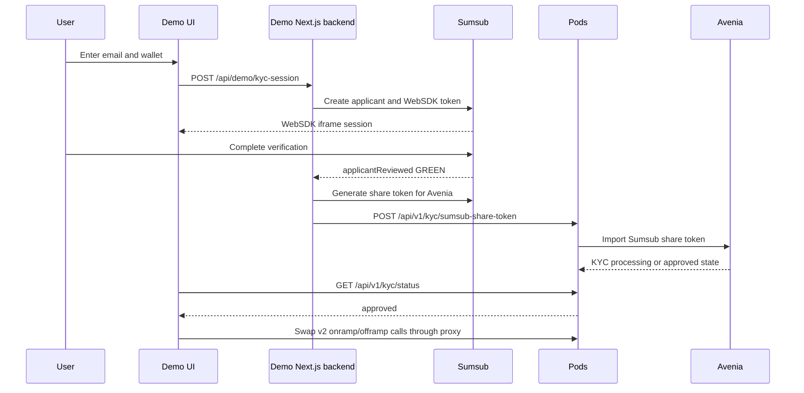

# Pods KYC Demo Flow Handoff

This document explains the demo flow for engineers who need to understand or
extend the customer-facing Pods KYC demo.

## High-Level Flow



## KYC GREEN

`GREEN` is the Sumsub review answer that means the applicant passed verification.
In this demo, the local Next.js backend behaves like the customer's backend:

1. Sumsub sends `applicantReviewed`.
2. The backend checks that `reviewStatus=completed`.
3. The backend checks that `reviewResult.reviewAnswer=GREEN`.
4. The backend generates a fresh Sumsub share token for Avenia.
5. The backend sends that token to Pods.

The UI polls Pods status and enables money movement only when the normalized
local status is `approved`.

Relevant files:

- `src/app/api/customer-webhooks/sumsub/route.ts`
- `src/app/api/demo/kyc-status/route.ts`
- `src/features/kyc-demo/domain/status.ts`
- `src/features/kyc-demo/hooks/use-kyc-flow.ts`
- `src/features/kyc-demo/components/local-status-panel.tsx`

## Sumsub Share Token

The share token is generated by the customer backend after an approved Sumsub
review. It is short-lived and should be generated fresh for each approved
applicant import.

Pods receives only the token and customer-facing metadata:

```text
POST /api/v1/kyc/sumsub-share-token
```

The demo never stores the share token in browser state. The server-side route
uses the configured Sumsub app token and secret key to generate it, then submits
it to Pods.

Relevant files:

- `src/lib/customer-simulator/sumsub.ts`
- `src/lib/customer-simulator/webhook.ts`
- `src/app/api/customer-webhooks/sumsub/route.ts`

## Pix BRL -> USDC Base Onramp

The onramp card creates a Pix quote that settles USDC on Base into the user's
approved wallet.

Browser call:

```text
POST /api/demo/pods
```

Forwarded server-side call:

```text
GET /v2/swap/quote
```

Query parameters:

```text
originChain=fiat
destinationChain=base
tokenIn=BRL
tokenOut=0x833589fCD6eDb6E08f4c7C32D4f71b54bdA02913
amountIn=<BRL minor units>
destinationAddress=<approved wallet>
```

The UI renders:

- Pix copy-paste code;
- quote ID;
- expiration;
- input and output amounts;
- fee breakdown.

Relevant files:

- `src/features/kyc-demo/domain/transfers.ts`
- `src/features/kyc-demo/hooks/use-money-movement.ts`
- `src/features/kyc-demo/components/money-movement-panel.tsx`
- `src/features/kyc-demo/components/transfer-result-details.tsx`
- `src/app/api/demo/pods/route.ts`

## USDC Base -> BRL Pix Offramp

The offramp card first creates a quote, then asks the backend for the transaction
or deposit instructions required to transfer USDC on Base and receive BRL by Pix.

First forwarded server-side call:

```text
GET /v2/swap/quote
```

Query parameters:

```text
originChain=base
destinationChain=fiat
tokenIn=0x833589fCD6eDb6E08f4c7C32D4f71b54bdA02913
tokenOut=BRL
amountIn=<USDC raw units>
originAddress=<approved wallet>
```

Second forwarded server-side call:

```text
POST /v2/swap/bytecode
```

Body:

```json
{
  "quoteId": "QUOTE_ID",
  "originAddress": "0xApprovedWallet",
  "pixKey": "PIX_KEY",
  "destinationAddress": "PIX_KEY"
}
```

The backend response can include a USDC deposit address, transaction calldata, or
other execution details. The UI displays all supported response shapes through
the shared result details component.

Relevant files:

- `src/features/kyc-demo/domain/transfers.ts`
- `src/features/kyc-demo/hooks/use-money-movement.ts`
- `src/features/kyc-demo/components/money-movement-panel.tsx`
- `src/features/kyc-demo/components/transfer-result-details.tsx`
- `src/app/api/demo/pods/route.ts`

## Proxy Rules

The browser never receives `PODS_KYC_API_KEY`.

The local proxy only forwards supported routes:

- `GET /v2/swap/quote`
- `POST /v2/swap/bytecode`
- `GET /v2/swap/status/{quoteId}`

Any other `/v2` or `/api/v1` route is rejected by the demo proxy.

Relevant files:

- `src/app/api/demo/pods/route.ts`
- `src/app/api/demo/pods/route.test.ts`

## Test Checklist

Run:

```bash
npm test
npm run lint
npx tsc --noEmit
```

Manual check:

1. Start the app with `npm run dev -- -p 3000`.
2. Confirm `/api/demo/environment` points to the intended Pods backend.
3. Generate a Sumsub SDK link with email and wallet address.
4. Complete or load an approved KYC.
5. Generate a Pix BRL -> USDC Base quote.
6. Generate a USDC Base -> BRL Pix deposit address or transaction payload.
7. Confirm browser network requests never expose `PODS_KYC_API_KEY`.
